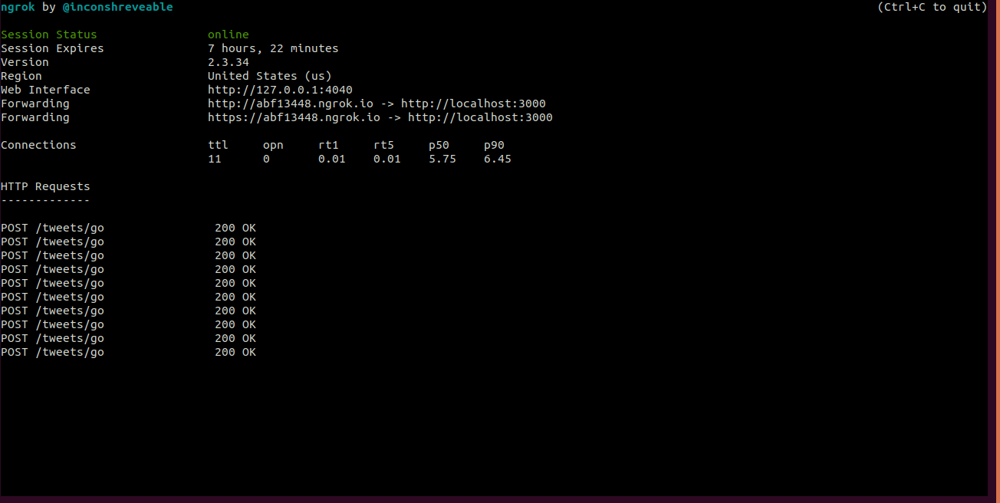
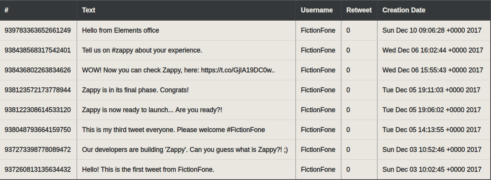

# Project Title

Zappy – The Pain Killer

Integrates with a Slack channel and listens on specific messages. Zappy will listen on all messages containing the word “go”. As soon as any member of the marketing team, places a messages on a channel containing the message “go”, Zappy will fetch twitter feeds from the FictionFone account and saves in a mongo collection and view that fetched tweets show in a table

## Getting Started

These instructions will get you a copy of the project up and running on your local machine for development and testing purposes.

### Prerequisites

- Node: v8.11.3 or higher - [Node](https://nodejs.org/en/)
- Angular CLI: v6.0.8 - [Angular CLI](http://www.dropwizard.io/1.0.2/docs/) 
- OS: linux x64
- MongoDB: v3.6.3
- Ngrok [Ngrok](https://ngrok.com/)

```Example:
npm install -g @angular/cli
ng new my-app
cd my-app
ng serve --open
```

### Installing

A step by step series of examples that tell you how to get a development env running

- Go to the root folder of the project
- In the terminal run "npm install" to install node_modules
- In the terminal run "npm start"  => to start nodejs server on port: 3000
- Change directory to zappy-front folder
- In the terminal run "ng serve" => to start front-end server on port: 4200
- Open terminal in the place where you downloaded Ngrok and start Ngrok server using the command "./ngrok http 3000" you should see something like this in your terminal
in order to be able to integrate with slack webhooks through localhost:3000


- Open your slack webhooks setting to add the new host that ngrok gives you. If you find it hard to setup you can read step from slack docs here [https://api.slack.com/custom-integrations/outgoing-webhooks](https://api.slack.com/custom-integrations/outgoing-webhooks)

```Example:
cd zappy
npm start
cd zappy-front
ng serve
```

Now lets walk through steps to test out app:

- Go to frontend page on locahost:4200, you will see empty table
- Open slack through the link - [Slack](https://app.slack.com/client/TLU4WCL4D/CLJAF2119)
- Go to channel called Marketing and hit go message
- Again go back to the frontend page on localhost:4200 you will see the tweets fetched from the "FictionFone" account on twitter
- Check your database tweets you will find tweets inserted there
- After compeleting the steps you should see table like this:


## Running the tests

- Change directory to your root folder
- Run "npm run test" in the terminal
- You should see all the passed and failed tests

### coding style

Eslint to enforce "airbnb-base" coding style
JSDoc API documentation to document everything

## Project Folder Structure

`├── app.js
 ├── bin
 │   └── www
 ├── config
 │   └── twitter_client_set_up.js
 ├── controllers
 │   └── TweetController.js
 ├── database.js
 ├── models
 │   └── tweet.js
 ├── package.json
 ├── package-lock.json
 ├── public
 │   ├── images
 │   ├── javascripts
 │   └── stylesheets
 ├── Readme.md
 ├── routes
 │   ├── index.js
 │   └── tweets.js
 ├── services
 │   └── TweetService.js
 ├── tests
 │   └── unit
 ├── views
 │   ├── error.jade
 │   ├── index.jade
 │   └── layout.jade
 └── zappy-front
     ├── angular.json
     ├── e2e
     ├── node_modules
     ├── package.json
     ├── package-lock.json
     ├── README.md
     ├── src
     ├── tsconfig.json
     └── tslint.json`

## Authors

* **Wesam Mustafa** - *Initial work* - [Wesam Mustafa](https://github.com/wesammustafa)

## License

This project is licensed under the MIT License 
